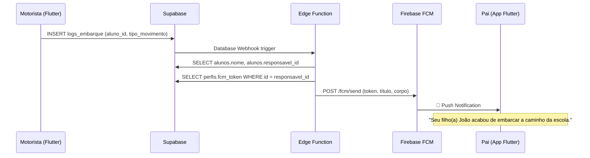

# Firebase Cloud Messaging — Push Notifications (0403)

## Propósito
Guia passo a passo para configurar o Firebase Cloud Messaging (FCM) no projeto RotaEscola Arapongas. O FCM é usado para enviar notificações push internas aos pais quando o motorista escaneia a carteirinha do aluno.

> [!IMPORTANT]
> **Estratégia aprovada:** Toda comunicação com os pais é feita exclusivamente via Push Notifications internas. WhatsApp/Evolution API foram descartados.

---

## Pré-requisitos
- Conta Google (pode ser a mesma do Supabase)
- App Flutter compilado (para obter `google-services.json`)

---

## Passo 1 — Criar Projeto no Firebase Console

1. Acesse [console.firebase.google.com](https://console.firebase.google.com)
2. Clique em **"Adicionar Projeto"**
3. Nome do projeto: `RotaEscola Arapongas`
4. Desabilite Google Analytics (não é necessário para push)
5. Clique **"Criar Projeto"**

---

## Passo 2 — Registrar o App Android (Flutter)

1. No console do Firebase, clique em **"Adicionar App" → Android**
2. Nome do pacote: `br.gov.arapongas.rotaescola` (ou o ID do seu app Flutter)
3. Apelido: `RotaEscola Mobile`
4. Baixe o arquivo `google-services.json`
5. Coloque-o em `mobile/android/app/google-services.json`

---

## Passo 3 — Obter a Server Key (FCM)

1. No Firebase Console, vá para **Configurações do Projeto** (ícone de engrenagem)
2. Aba **"Cloud Messaging"**
3. Na seção **"Cloud Messaging API (Legacy)"**, clique em **"Habilitar"** se necessário
4. Copie a **"Server key"** — este é o valor do `FCM_SERVER_KEY`

> [!CAUTION]
> **NUNCA** exponha a Server Key no frontend ou em repositórios públicos. Ela deve ser salva APENAS como variável de ambiente no Supabase.

---

## Passo 4 — Configurar a Variável no Supabase

1. Acesse o [Dashboard do Supabase](https://supabase.com/dashboard)
2. Selecione o projeto **RotaEscola Arapongas**
3. Vá em **Settings → Edge Functions**
4. Adicione a variável de ambiente:
   - **Nome:** `FCM_SERVER_KEY`
   - **Valor:** Cole a Server Key do Firebase

---

## Passo 5 — Configurar o Database Webhook

1. No Supabase Dashboard, vá em **Database → Webhooks**
2. Clique em **"Create Webhook"**
3. Configure:
   - **Nome:** `push-embarque-webhook`
   - **Tabela:** `logs_embarque`
   - **Eventos:** `INSERT`
   - **Tipo:** `Supabase Edge Function`
   - **Função:** `enviar-push-embarque`
4. Clique **"Create"**

---

## Passo 6 — Configurar o Flutter (App do Responsável)

### Dependências necessárias no `pubspec.yaml`:
```yaml
dependencies:
  firebase_core: ^3.0.0
  firebase_messaging: ^15.0.0
```

### Código para obter e salvar o token:
```dart
import 'package:firebase_messaging/firebase_messaging.dart';
import 'package:supabase_flutter/supabase_flutter.dart';

Future<void> configurarPush() async {
  final messaging = FirebaseMessaging.instance;
  
  // Solicitar permissão
  await messaging.requestPermission(
    alert: true,
    badge: true,
    sound: true,
  );
  
  // Obter token FCM
  final fcmToken = await messaging.getToken();
  
  if (fcmToken != null) {
    // Salvar token na tabela perfis do Supabase
    final user = Supabase.instance.client.auth.currentUser;
    if (user != null) {
      await Supabase.instance.client
        .from('perfis')
        .upsert({
          'id': user.id,
          'fcm_token': fcmToken,
        });
    }
  }
  
  // Escutar renovação de token
  messaging.onTokenRefresh.listen((newToken) async {
    final user = Supabase.instance.client.auth.currentUser;
    if (user != null) {
      await Supabase.instance.client
        .from('perfis')
        .update({'fcm_token': newToken})
        .eq('id', user.id);
    }
  });
}
```

---

## Fluxo Completo (Ponta a Ponta)



---

## Arquivos Relacionados
| Arquivo | Responsabilidade |
|---|---|
| `supabase/functions/enviar-push-embarque/index.ts` | Edge Function que envia o push |
| `supabase/migrations/20260528150100_create_perfis.sql` | Tabela perfis com coluna `fcm_token` |
| `supabase/migrations/20260528150000_create_carteirinhas_e_logs.sql` | Tabela `logs_embarque` (gatilho) |

## Histórico de Alterações
| Data | Alteração |
|---|---|
| 28/05/2026 | Documentação criada (0403) — Passo a passo completo de FCM |
